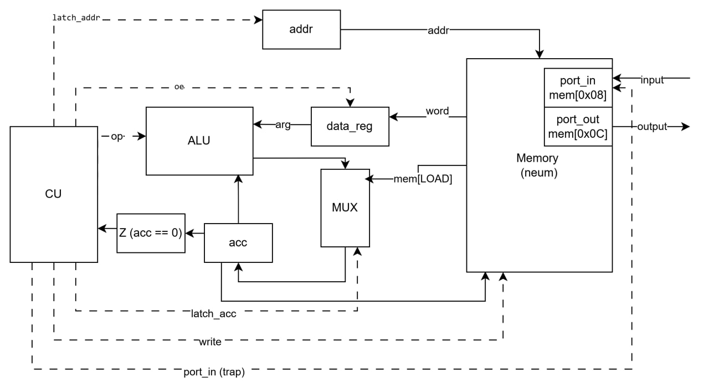
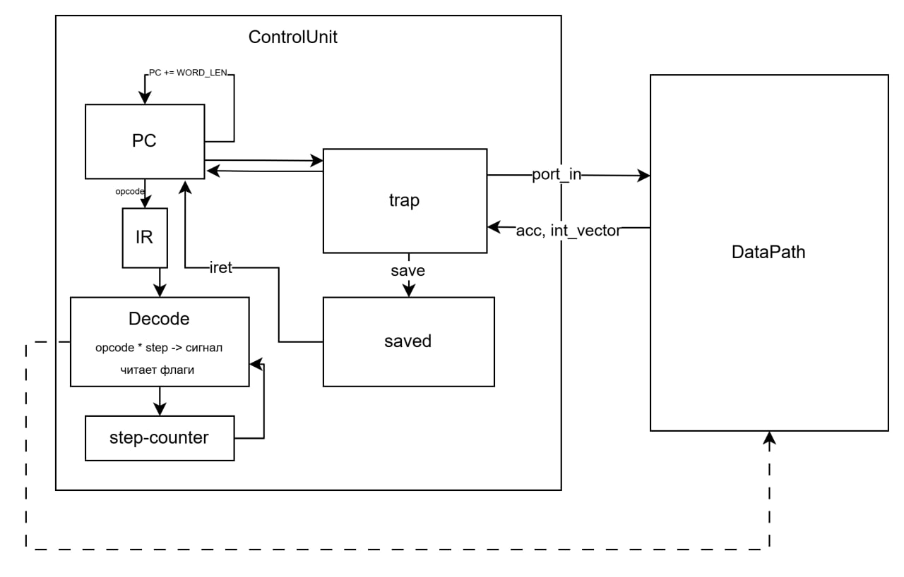

# Лабораторная работа №4 — «Эксперимент»

- **Студент:** Рябцева В.А.
- **Группа:** Р3222
- **Вариант:** `lisp | acc | neum | hw | tick | binary | trap | mem | pstr | prob1 | superscalar` выполнено без дополнительного задания

---

## Язык программирования

Диалект Lisp.

### BNF

```
program     ::= s_expr
s_expr      ::= atom | "(" list ")"
list        ::= s_expr*
atom        ::= integer | float | double | boolean | string | ident

integer     ::= ["-"] digit+
float       ::= ["-"] digit+ "." digit+
double      ::= ["-"] digit+ "." digit+ ("d" | "D")
boolean     ::= "true" | "false"
string      ::= '"' char* '"'
ident       ::= (letter | "_") (letter | digit | "_" | "-")*

s_expr      ::= "(" "defun" ident "(" ident* ")" s_expr ")"
              | "(" "lambda" "(" ident* ")" s_expr ")"
              | "(" "if" s_expr s_expr s_expr ")"
              | "(" "progn" s_expr+ ")"
              | "(" "while" s_expr s_expr ")"
              | "(" "setq" ident s_expr ")"
              | "(" ident s_expr* ")"
              | atom
```

### Семантика

| Форма                  | Описание |
|------------------------|------------------------------------------------------------------------------------|
| `(defun f (a b) body)` | Определение именованной функции; результат — значение `body`                       |
| `(lambda (a) body)`    | Анонимная функция; замыкание захватывает переменные                                |
| `(if cond t f)`        | Условное выражение; тип `t` и `f` совпадают                                        |
| `(progn e1 … en)`      | Последовательное вычисление; тип = тип `en`                                        |
| `(while cond body)`    | Цикл; `cond` — BOOLEAN; возвращает VOID                                            |
| `(setq x e)`           | Мутирующее присваивание; возвращает VOID                                           |
| `(f a b …)`            | Применение функции                                                                 |
| Литералы               | INTEGER (32 бит), FLOAT (32 бит), DOUBLE (64 бит), BOOLEAN, STRING (Pascal-строка) |

**Типы:** INTEGER, FLOAT, DOUBLE, BOOLEAN, STRING, VOID, FUNC[...→...].
Статически выводятся алгоритмом Хиндли–Милнера (унификация).

**Мутабельность.** По умолчанию переменные иммутабельны. `setq` допускается только для параметров функции/лямбды. Если мутируемый параметр захвачен лямбдой — **автобоксинг**: значение хранится в куче, а слот памяти содержит указатель на него.

**Ввод/вывод:** через встроенные функции `(input)` и `(print ...)`.

---

## Организация памяти

Архитектура - **фон Нейман** (neum): код и данные делят единое 32-битное адресное пространство; слово = 4 байта.

```
Адрес (байт)   Содержимое
─────────────────────────────────────────────────────
0x00             HEAP                       - указатель на следующую свободную ячейку кучи
0x04             K                          - текущее продолжение (continuation-адрес)
0x08             PORT_IN                    - порт ввода (memory-mapped; запись ISR)
0x0C             PORT_OUT                   - порт вывода (memory-mapped; чтение принтером)
0x10 .. 0x4F     ARG_SLOT_1 … ARG_SLOT_16   - слоты передачи аргументов
0x50             INT_VECTOR_INPUT           - адрес обработчика прерывания ввода
0x54             DEFAULT_INT_HANDLER_INPUT_NEXT_BUF_IDX
0x58 .. 0xD7     Буфер прочитанных символов (32 слова × 4 байт)
0xD8 .. X-1      Слоты переменных (статически аллоцированы транслятором)
X    .. Y-1      Байткод обработчика прерывания (ISR)
Y    .. конец    Байткод пользовательской программы (entry_point = Y)
```

Строки хранятся в **pstr**-формате: сначала слово длины, затем по одному слову на символ.
Все значения знаковые int32 (big-endian по умолчанию little-endian в бинарнике).

---

## Система команд (ISA)

Архитектура **acc**: единственный явный регистр - аккумулятор `acc`. Все ALU-операции работают через `acc`.

Каждая инструкция занимает **1 или 2 слова** (опкод, аргумент).

| Мнемоника                                    | Аргумент     | Действие                    | Тактов |
|----------------------------------------------|--------------|-----------------------------|--------|
| `HALT`                                       | -            | Останов                     | 2      |
| `LOAD #imm`                                  | imm          | `acc <- imm`                | 2      |
| `LOAD [ptr]`                                 | [addr]       | `acc <- mem[addr]`          | 3      |
| `LOAD IND [ptr]`                             | [addr]       | `acc <- mem[mem[addr]]`     | 4      |
| `STORE [ptr]`                                | [addr]       | `mem[addr] <- acc`          | 3      |
| `STORE IND [ptr]`                            | [addr]       | `mem[mem[addr]] <- acc`     | 4      |
| `ADD / SUB / MUL / DIV / MOD     #imm/[ptr]` | imm / [addr] | арифметиеские операции      | 3      |
| `AND / OR  / ASL / ASR / LSR     #imm/[ptr]` | imm / [addr] | побитовые операции / сдвиги | 2      |
| `EQ  / NE  / LT  / LE  / GT / GE #imm/[ptr]` | imm / [addr] | логические операции         | 2      |
| `JMP #target`                                | addr         | `PC <- target`              | 2      |
| `JMP_T #target`                              | addr         | `if acc != 0: PC <- target` | 2      |
| `INT`                                        | -            | программное прерывание      | 2      |
| `IRET`                                       | -            | возврат из ISR              | 2      |

**Кодирование (binary):** опкод — 32-битное слово (значение enum `BC`); аргумент — следующее 32-битное слово (присутствует только у 2-словных инструкций).

**Такты.** Каждая инструкция выполняется за 2–4 такта:

```
step 0 FETCH    - addr <- PC,  oe -> IR.opcode
step 1 OPERAND  - addr <- PC+4, oe -> IR.arg    (только 2-словные)
step 2 ADDRESS  - addr <- IR.arg, oe -> data_reg (только *_MEM)
step 3 EXECUTE  - ALU + latch acc / signal_wr / PC <- next
```

**Ввод/вывод - trap:** при наступлении запланированного тика ControlUnit сохраняет `PC` и `acc`, записывает символ в `PORT_IN` и передаёт управление по вектору `INT_VECTOR_INPUT`. Обработчик читает из `PORT_IN` и завершается `IRET`.

---

## Транслятор

```
python translator.py <source.lisp> <output.bin>
```

Выходные файлы:
- `<output.bin>` - бинарный образ (данные + байткод);
- `<output.bin>.entry` - 8 байт: `entry_point` (4 байта) + `code_start` (4 байта).

Этапы трансляции:

1. **Лексер** - разбивает исходный текст на токены (числа, строки, идентификаторы).
2. **Парсер** - строит дерево S-выражений.
3. **Анализ S-выражений** (`lang/parser/s_expr.py`) - распознаёт `defun`, `lambda`, `if`, `progn`, `while`, `setq`, вызовы.
4. **CPS-трансформация** (`lang/parser/cps.py`) - весь код переводится в CPS; продолжения становятся явными лямбдами.
5. **Назначение имён** (`lang/parser/qualname_assign`) - каждой вершине дерева назначается уникальный квалифицированный путь; разрешаются ссылки на встроенные функции; вычисляются `mutable_paths` и `autoboxed_paths`.
6. **Вывод типов** (`lang/parser/inferrer`) - алгоритм Хиндли–Милнера; все типы разрешаются статически.
7. **Аллокация памяти** (`memory`) - статически распределяет слоты для переменных, констант, слотов аргументов.
8. **Генерация байткода** (`compiler`) - обход CPS-дерева; для `while` - JMP; для `setq` - STORE/STORE\_IND\_MEM; для встроенных - inline-расширение.

---

## Модель процессора

### DataPath



### ControlUnit



---

## Тестирование

Тесты - **golden-файлы** в `tests/cases/`. Каждый кейс содержит:
- `*.lisp` - исходный код;
- `*.json` - ожидаемый результат: `{"acc": N, "output": "...", "input": [...]}`;
- `*.bin.txt` - ожидаемый hex-дамп байткода (опционально);
- `*.log.txt` - ожидаемый лог выполнения (опционально).

Запуск тестов:
```
python -m unittest discover -s tests -v
```

### Описание тест-кейсов

| Группа             | Кейс                                         | Описание                          |
|--------------------|----------------------------------------------|-----------------------------------|
| `arithmetic`       | `simple_addition` ... `nested`               | Базовые целочисленные операции    |
| `comparison`       | `eq_true`, `lt`, `gt` ...                    | Операторы сравнения               |
| `logic`            | `and_true`, `or_false` ...                   | Логические И / ИЛИ                |
| `conditional`      | `if_true`, `nested_if`                       | Условные выражения                |
| `functions`        | `square`, `recursive_factorial`, `fibonacci` | Рекурсия и multiple args          |  
| `lambda`           | `simple_lambda`, `closure`                   | Анонимные функции, замыкания      |
| `strings`          | `hello`, `concat`, `int_to_string`           | Строки и преобразования           |
| `doubles`          | `add_literals`, `to_string_42` ...           | IEEE 754 double (64 бит)          |
| `type_conversions` | `int_to_double`, `double_to_int` ...         | Приведение типов                  |
| `setq`             | `simple`, `with_expression`                  | Мутирующее присваивание           |
| `while`            | `count_down`, `sum_1_to_10`, `factorial`     | Цикл while                        |
| `autoboxing`       | `mutable_captured_by_lambda`                 | Автобоксинг мутируемых переменных |
| `io`               | `cat`, `hello_user_name`, `sort`             | Ввод/вывод через trap             |
| `euler`            | `prob1_n1000`                                | Задача Эйлера #1                  |
| `complex`          | `sum_of_multiples`, `conditional_output` ... | Составные программы               |

### Задача Эйлера №1

```lisp
; prob1_n1000.lisp
(defun triangular (m) (/ (* m (+ m 1)) 2))
(defun sum-k (n k) (* k (triangular (/ (- n 1) k))))
(- (+ (sum-k 1000 3) (sum-k 1000 5)) (sum-k 1000 15))
```

Ожидаемый результат: `acc = 233168`.

### Пример: cat (echo ввода)

```lisp
; cat.lisp
(print (input))
```

Запрос `input` суспендирует выполнение; ControlUnit получает прерывание, записывает Pascal-строку в память через `PORT_IN`, возвращает управление. `print` выводит её через `PORT_OUT`.

---

## Статический анализ

```
python -m ruff check .      # линтер
python -m ruff format --check .  # форматирование
python -m mypy .            # типизация
```

CI проверяет все три инструмента при каждом push в `.github/workflows/ci.yml`.
